# Architecture Diagram

## Component Hierarchy

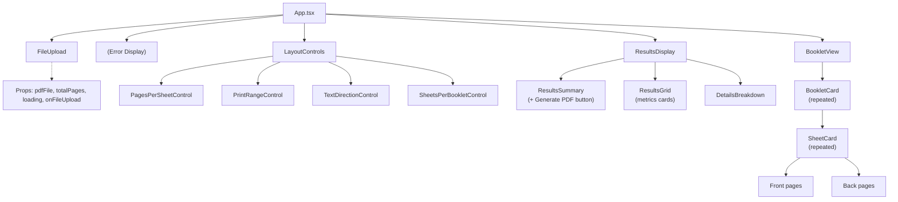

---

## Data Flow Diagram

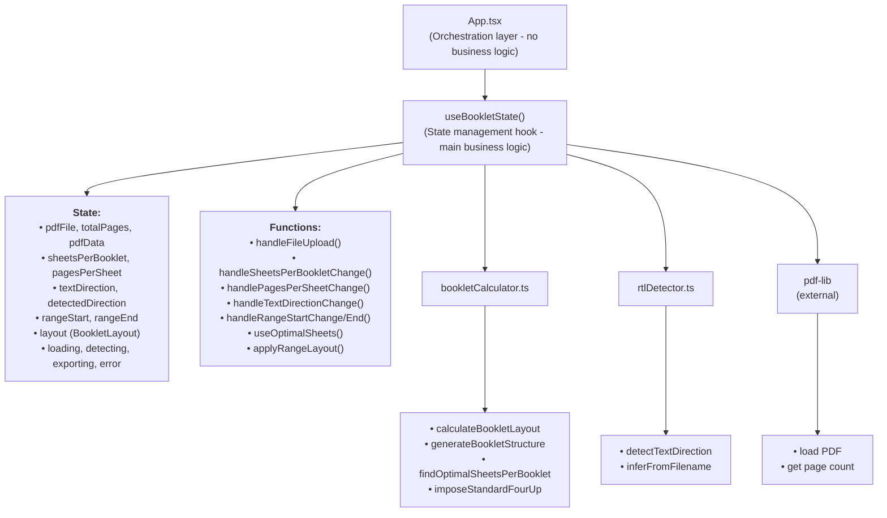

---

## User Interaction Flow

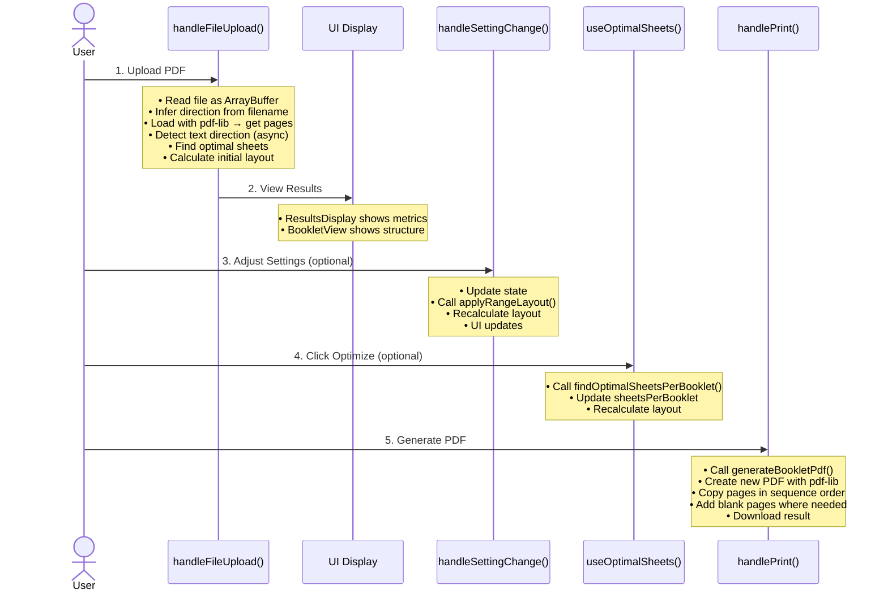

---

## State Update Flow

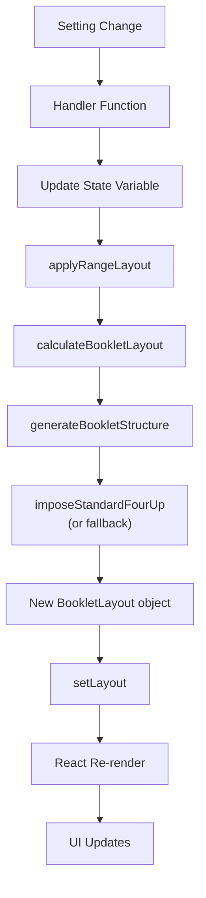

---

## Calculation Algorithm Flow

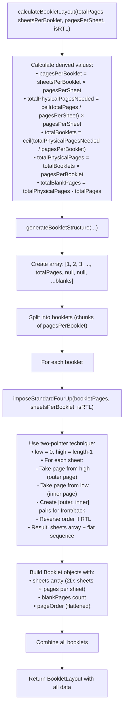

---

## PDF Generation Flow

```mermaid
graph TD
    A["useBookletPdfGenerator(pdfData, layout)"]
    A --> B[Returns async function]
    B --> C[Load source PDF with pdf-lib]
    C --> D[Create new blank PDF]
    D --> E[Get default page size from source]
    E --> F[For each page number in layout.sequence]
    F --> G{pageNum === null?}
    G -->|Yes| H[Add blank page with default size]
    G -->|No| I["Calculate absolute index:<br/>absoluteIndex = (rangeStart - 1) + (pageNum - 1)"]
    I --> J[Copy page from source[absoluteIndex]]
    J --> K[Add to new PDF]
    H --> L{More pages?}
    K --> L
    L -->|Yes| F
    L -->|No| M["Return PDF.save() → Uint8Array"]
    M --> N["downloadPdfBlob(bytes, filename)"]
    N --> O[Create Blob → Create URL → Trigger download]
```

---

## RTL Detection Flow

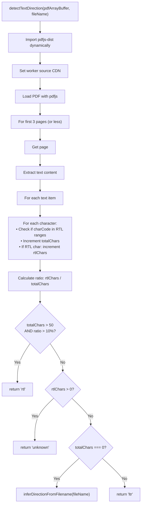

---

## Component Communication

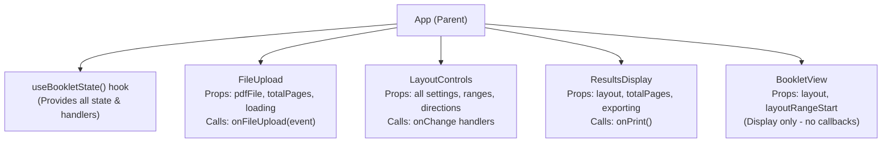

---

## Module Dependencies

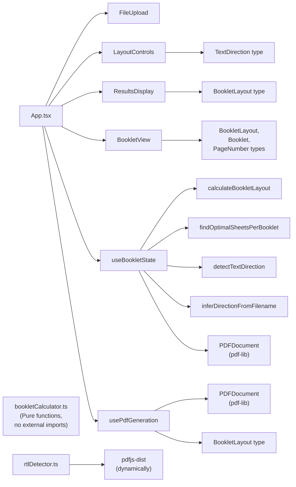

---

## State Management Pattern

**Pattern**: Centralized hook with derived state

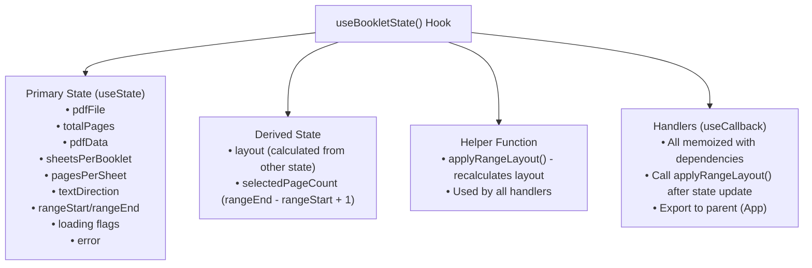

**Why this pattern**:
- Single source of truth
- Handlers colocated with state
- Easy to test (hook can be tested independently)
- No prop drilling (all state in one place)

---

## Error Handling Flow

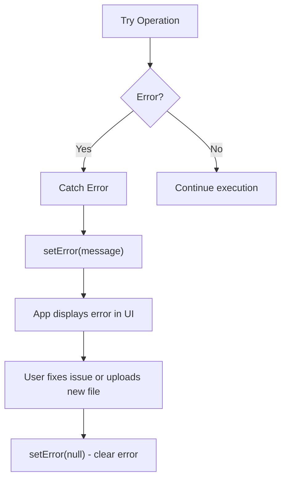

**Error types**:
- File upload errors (wrong type, read failure)
- PDF parsing errors (corrupted PDF)
- Calculation errors (invalid parameters)
- PDF generation errors (page out of bounds)
- RTL detection errors (non-fatal, fallback to filename)

---

## Optimization Points

### Current Bottlenecks
1. **PDF Loading**: Synchronous, blocks UI
2. **Text Detection**: Samples 3 pages (could be slow for large pages)
3. **PDF Generation**: Synchronous, blocks UI
4. **Layout Recalculation**: Happens on every setting change

### Potential Optimizations
1. Move PDF operations to Web Worker
2. Debounce layout recalculation
3. Cache RTL detection results
4. Virtualize BookletView for many booklets
5. Progressive loading for large PDFs

---

## Testing Strategy

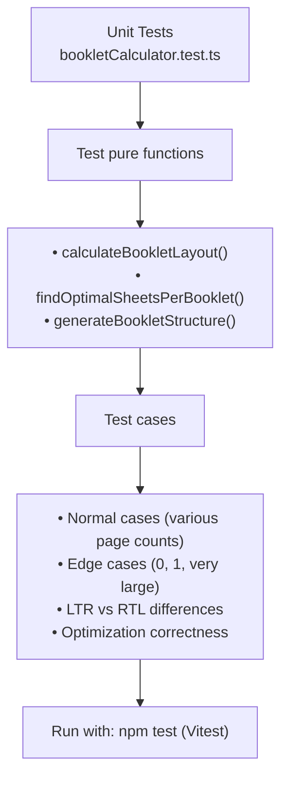

**Not currently tested** (could be added):
- Component rendering (React Testing Library)
- Hook behavior (React Hooks Testing Library)
- PDF generation (integration test with sample PDF)
- RTL detection (mock pdfjs-dist)

---

## Build Process

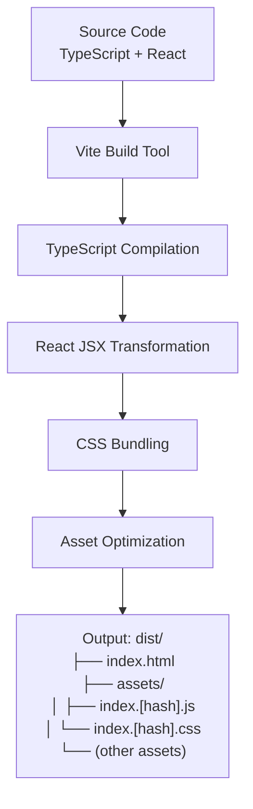

---

## Extension Points

### To Add New Features

**New page layout** (e.g., 2-up):
```
1. Add option in LayoutControls
2. Add imposition logic in bookletCalculator
3. Update validation in useBookletState
```

**Save/Load Settings**:
```
1. Add localStorage functions
2. Add buttons in LayoutControls
3. Call load on mount, save on change
```

**Preview Pages**:
```
1. Add new component PreviewPanel
2. Use pdfjs-dist to render pages to canvas
3. Show in BookletView or modal
```

**Batch Processing**:
```
1. Change FileUpload to accept multiple files
2. Add file list UI
3. Process in loop or parallel
4. Zip results or individual downloads
```

---

This architecture document provides a visual and structural overview of the application. Refer to `AGENT_DOCS.md` for detailed implementation information.
